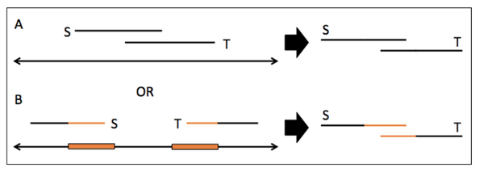
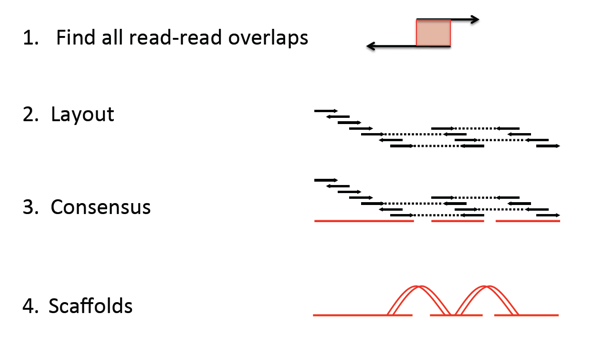

# Learning Objectives

Upon completion of this section on Genome Assembly you will understand the following:

* What are the goals of a genome assembly project?
* Why is it a Genome assembly a hard problem?
* What are the two main Genome Assembly Algorithms?
* Which Genome Assembler should I use?

# What are the goals of a Whole Genome Sequence Assembly project?

  * Determine the complete genome sequence of an organism(animal, plant, fungus, bacterium, etc.)
  * Assemble and organize the sequence(into chromosomes)
  * Annotate the protein-coding gene sequence(and other genetically important functional features)

Like any scientific endeavor, genome assembly starts with experimental design and its success depends on the following.
  * Nature of the genome being sequenced
  * The quality of the sample taken for sequencing
  * The limits of the sequencing technology used to generate the data to be assembled
    * Length, quality and error
  * The software used to assemble the genomic pieces

# Why is it a Genome assembly a hard problem?

* ## Polymorphism
  -  Diploid (having pairs of chromosomes)
    -  Reads from regions on homologous chromosomes may differ
  - Chimera
    - One organism with multiple genomes in the same sample
  - Multiple individuals
    - Some species are so small that to obtain enough DNA requires more than a single individual

*  ## Repeats
  - SINEs = Short INterspersed Elements
    - Usually ~500 b in length
    - About 1.5M in the human genome
  - LINEs = Long INterspersed Elements
    - Usually ~1 Kb in length
    - About 0.5M in the human genome
  - Large repeats, segmental duplications...
    - 40 Kb and more!
  - Polyploidy
    - Whole genome duplications
    - Multiple copies of chromosomes
  - Paleopolyploidy
    - Polyploidy that happened millions of years ago and where the organism has re-diploidized
    - Many genomic regions will be duplicated
  - Example of how Repeats can fool an assembler
    - Consider two reads S and T with a region in orange that is a stretch of 20 Adenine nucleotides (A)
    - It is unclear from a read-to-read alignment if S and T really overlap or if they from two copies of the same repeat

    

*  ## Sequencing Error

  - Different sequencing technologies have different types of errors
  - Base accuracy varies - Phred scores
  - Logarithmically linked to probability of error
    - Q10: P[wrong base call] = 1 in 10
    - Q20: P[wrong base call] = 1 in 100
    - Q30: P[wrong base call] = 1 in 1,000
    - Q40: P[wrong base call] = 1 in 10,000
    - Q50: P[wrong base call] = 1 in 100,000
    - Q50 is considered very good
  - There are thousands of errors in assembled genomes!

*  ## Sample contamination

  -  Contamination from human, bacteria and virus are common
    - PhiX for example is a very common contaminant that can be misassembled into genomes
      - Read [Large-scale contamination of microbial isolate genomes by Illumina PhiX control](https://environmentalmicrobiome.biomedcentral.com/articles/10.1186/1944-3277-10-18)for more details on this issue.
    - If your sample includes the gut of an organism expect there to be some level of contaminating reads that do not belong to the organism.

* ## Expertise
  Requires the installation of assembly programs, learning how they work, testing of parameters to optimise the output.  Lots of assemblers out there to choose from.

# What are the two main Genome Assembly Algorithms?

There are two main classes of genome assembly: Overlap Layout Consensus (OLC) amd Debruijn Graph (DBG).

* ## Overlap Layout Consensus

 Overlap layout consensus is an assembly method that takes all reads and finds overlaps between them, then builds a consensus sequence from the aligned overlapping reads.  

  

  Lines with arrows represent reads.  Dotted lines join paired reads.  Red lines are contigs.  Arrows represent directionality of read alignment.

* ## De Bruijn Graph (DBG) or k-mer approach

  * Chop the reads into k-mers
  * Construct DBG from k-mers
  * Representing a sequence in terms of its k-mer components
  * Find Eulerian path in the graph
  * Derive the genome sequence from the graph

|Example with a 3-mer graph of A and B| |
|:-|-|
|Suppose we are given a set of symbols,(say A and B) and we are given a length (say 3), then a de Bruijn graph  is constructed by generating all possible sequences of length k=3 (eg. AAA, AAB, ABA, ABB… , BBB). These “3-mers”  then become nodes in the graph. Directed edges are drawn between nodes (say X and Y) that differ by one symbol   with Y being a left-shifted version of X. |  |

From the example above, it is easy to see how short k-mers can result in many paths resulting in many possible assemblies.

# Which Genome Assembler should I use?
  There are many genome assembly programs out there to choose from and depending on the type of sequencing technology was used to generate the raw data and the organism you are assembling it can be challenging to decide which assembler to use.  Here are some basic guidelines to determine which assembler may give you the best assembler (a place to start)

  * If you are working on a Prokaryotic genome, we recommend starting with [SPAdes](../GenomeAssembly/Assemblers/spades.md) as it works well for small genomes and is not recommended for large ones
  * If you are working with a Eukaryotic genome and have
    * Only Short reads we recommend [MaSuRCA](../GenomeAssembly/Assemblers/MaSuRCA.md)
    * Only Long reads, we recommed either [Canu](../GenomeAssembly/Assemblers/canu.md) or Falcon
    * If you have both short and long reads we recommend [MaSuRCA](../GenomeAssembly/Assemblers/MaSuRCA.md)
    * If your genome is highly heterozygous, you may want to use [Example using Platanus](../GenomeAssembly/Arabidopsis/AT_platanus-genome-assembly.md)

---

# Further Reading

* [Large-scale contamination of microbial isolate genomes by Illumina PhiX control](https://environmentalmicrobiome.biomedcentral.com/articles/10.1186/1944-3277-10-18)

* ## Acknowledgements

  Some material for this tutorial was taken with permission from the [BroadE Workshop on Genome Informatics from 2013](https://docs.google.com/file/d/0B2dK2q40HDWeVFhFR3dBLXBDSUk/edit) written by Sante Gnerre, Aaron Berlin and Sean Sykes.

[Back to the Assembly and Annotation Index page](../GenomeAnnotation/annotation_and_assembly_index.md)
